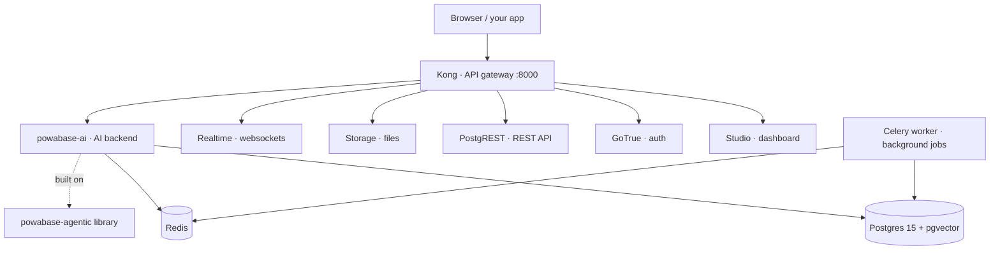

# Powabase OSS — single-project stack

A self-hostable, single-project AI backend: Postgres + Auth + Storage + REST (Supabase data plane) plus
the Powabase AI service (sources, knowledge bases, agents). One `docker compose up`, no control plane.

## Architecture

Powabase's OSS edition is **one self-contained stack** you run with Docker
Compose. It spans three repositories:

| Repo | What it is | How you use it |
|---|---|---|
| **[powabase](https://github.com/powabase-ai/powabase)** (this repo) | The self-host **stack** — Docker Compose, the Kong gateway, the `ai` schema, and the Studio dashboard | `docker compose up` — **this is the repo you run** |
| **[powabase-ai](https://github.com/powabase-ai/powabase-ai)** | The **AI backend service** (`ghcr.io/powabase-ai/powabase-ai`) — sources, knowledge bases, agents, workflows | pulled automatically by the compose; you don't run it directly |
| **[agentic](https://github.com/powabase-ai/agentic)** (PyPI [`powabase-agentic`](https://pypi.org/project/powabase-agentic/)) | The **library** the backend is built on — agents, knowledge, orchestration, workflows | `pip install powabase-agentic`, only if you want it standalone |

Everything is reached through a single Kong gateway on `:8000`:



<details>
<summary><strong>The 12 services in the stack</strong></summary>

**Powabase AI** (this edition's addition)
- `project-api` — AI backend HTTP API: sources, knowledge bases, agents, workflows · `ghcr.io/powabase-ai/powabase-ai`
- `project-worker` — Celery worker: extraction, chunking, embedding, indexing · same image
- `redis` — Celery broker + result backend

**Supabase data plane**
- `kong` — API gateway; the single front door on `:8000`
- `studio` — the dashboard UI · `ghcr.io/powabase-ai/powabase-studio`
- `auth` — GoTrue: users, sign-in, JWTs
- `rest` — PostgREST: auto-generated REST API over your tables
- `storage` — S3-style file storage
- `imgproxy` — on-the-fly image transforms for Storage
- `meta` — postgres-meta: schema introspection for Studio
- `realtime` — Postgres change broadcasts over WebSockets
- `db` — Postgres 15 + pgvector: your data plus the `ai` schema

</details>

## Prerequisites
- Docker + Docker Compose
- Python 3.11+ with `pyjwt` and `cryptography` (`pip install pyjwt cryptography`) — only to run `gen-keys.py` once. If your system's interpreter is `python3`, use `python3 gen-keys.py` below.

No image build is needed — `docker compose up` pulls the published images from GitHub Container Registry (ghcr.io).

## Quickstart
```bash
cp .env.example .env        # 1. config with sane localhost defaults
python gen-keys.py          # 2. generate per-deployment secrets into .env
#                             3. set your LLM key(s): edit OPENAI_API_KEY (min) in .env
docker compose up -d        # 4. pull published images + boot the 12-service stack
docker compose ps           # 5. verify — every service should read "healthy"
```
The API gateway is at `http://localhost:8000`. Bring your own LLM keys (BYOK) in `.env`.
Studio dashboard at `http://localhost:8000/` (HTTP basic-auth via `DASHBOARD_*`) — it's not a separate port, the same Kong gateway fronts it.

> ⚠ `smoke-test.sh` is a separate **destructive** CI/boot test — it runs `docker compose down -v` (wiping all volumes) at start and on exit. Use it only to validate a *fresh* boot; **never run it against a deployment whose data you want to keep** — it will destroy your database.

## Security
- The API gateway (`:8000`) is the front door. Put it behind a reverse proxy with TLS before exposing it to the internet.
- Postgres is bound to `127.0.0.1` by default — don't publish it to other hosts.
- Public signup is disabled by default (`DISABLE_SIGNUP=true` in `.env`); create your first user via the admin API (service_role key), or re-enable signup once the deployment is secured.
- `/rest/v1` and `/auth/v1` require the project `apikey` header (anon or service_role key) as of this edition — RLS then differentiates the two roles.

## Updating
Image versions are pinned by tag in `docker-compose.yml` (e.g. `:0.1.0rc1`). To move to a newer release, bump those tags, then:
```bash
docker compose pull     # fetch the new images
docker compose up -d    # recreate only the changed services
```

## Notes
- Secrets in `.env` are generated locally and never committed. `.env` is git-ignored.
- Billing is disabled in this edition (no credit charges).
- To reset: `docker compose down -v` (removes volumes).
- After rotating a secret (e.g. `DASHBOARD_PASSWORD`) in `.env` on an already-running stack, apply it with `docker compose up -d --force-recreate kong` — Kong bakes templated `${...}` values from `.env` into `kong.yml` once, at container start, so a plain `docker compose restart kong` reuses the container's original environment and won't pick up the change.
